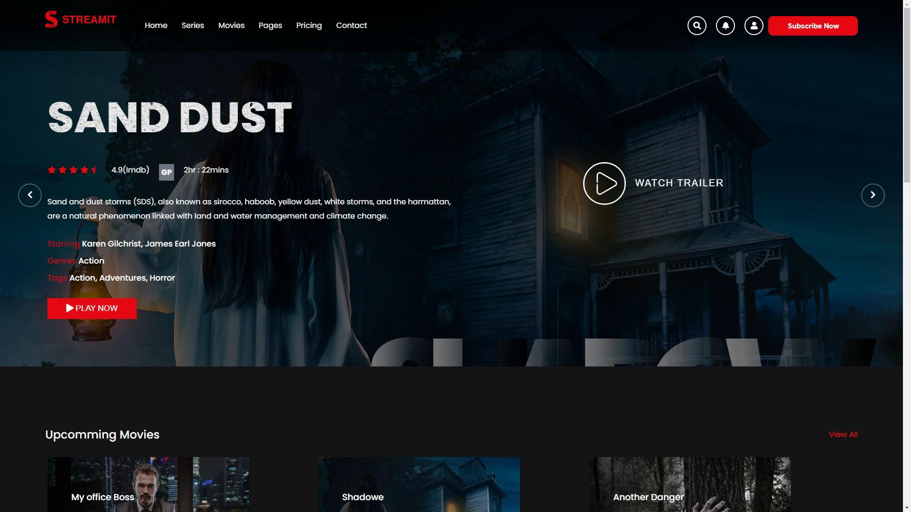

# Streamit

Podras ejecutar este proyecto ejecutando este comando en consola `npm start`.   

### Streamit es un clone de Netflix.

---

### En el inicio podemos ver un gran carrusel de peliculas.

### Carruseles de próximas y últimas peliculas.

### Carrusel de peliculas junto a su puntuación, resumen, género, tipo y trailer.

### Carrusel de peliculas recomendadas junto a el footer que contiene toda la información adicional necesaria.

